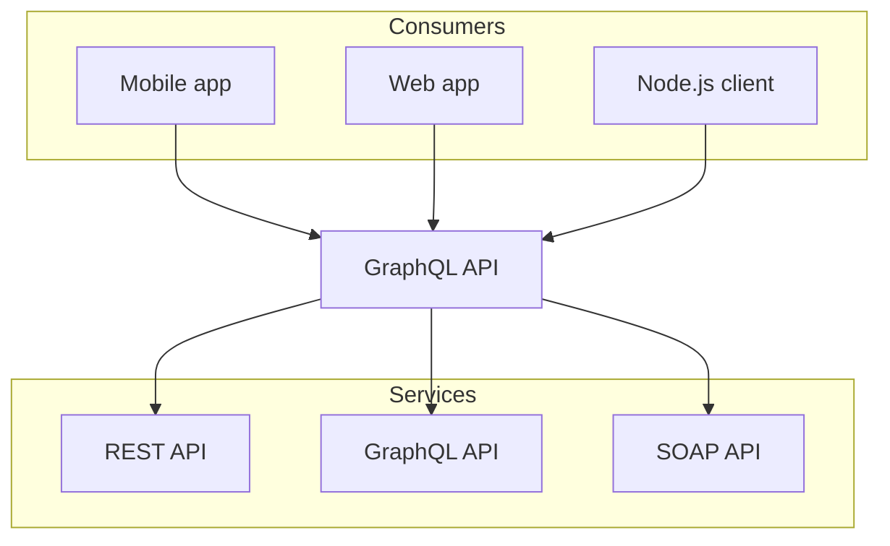

# How to add a new Supplier

After successful verification of the Agent's account you need to add your first Supplier to have access to travel products *(tours)* of this Supplier.
If an Agent doesn't add Supplier to the Agent's account on Edalem, the system can't show any tours to make reservations. 

{/*  */}

<Image src="/add-supplier/supplier1.png" alt="Add Supplier" width={800} height={600} />

## Getting credentials

Before adding the Supplier please contact Supplier's team to get your credentials. You need to get **Supplier ID** (Identificator), **Agent Login** and **Agent Password**.

<ColumnGroup>
    <ColumnItem>
        {/*  */}
        <Image src="/add-supplier/credentials1.png" alt="Supplier credentials" width={400} height={600} />
    </ColumnItem>

    <ColumnItem center={true}>
        <Alert type="error" title="Important Notice">
            Don't use this data, it's for demonstration use only!  
        </Alert>
    </ColumnItem>
</ColumnGroup>

If you don't have any information from the Supplier side, you can contact the Edalem team via email `info@edalem.io` and we'll assist you to get necessary information.

After getting Agent's credentials follow steps below:

<Timeline>

## Open Supplier's page
Choose Suppliers tab on the left sidebar, as shown in the screenshot
{/*  */}
<Image src="/add-supplier/suppliers2.png" alt="Suppliers tab" width={800} height={600} />

## Fill in the form
Fill the form with the information that you got from the Supplier
{/*  */}
<Image src="/add-supplier/form.png" alt="Fill in fields" width={800} height={600} />

## Click Create
Click Create and get confirmation of adding Supplier's tours to your Agent's account
{/*  */}
<Image src="/add-supplier/create.png" alt="Create" width={800} height={600} />

## Check Tours availability
To check Tours availability go to Calendar tab and click on Add Booking
{/*  */}
<Image src="/add-supplier/checkTours.png" alt="Check Tours" width={800} height={600} />

## Congratulations!
Congratulation! Tours from your first Supplier are now available for your reservations.
{/*  */}
<Image src="/add-supplier/openTours.png" alt="Open tours" width={800} height={600} />

</Timeline>

# Video Guide

If you prefer video guides, here is a short video on how to add your first Supplier to Agent's account on Edalem platform

<Video src='/add-supplier/addingSupplierVideo.mp4' controls width="100%" type="mp4" title="Video guide on how to register a new Agent's account on Edalem platform " />

{/* ## Next steps

Explore more guides on how to use Edalem platform

<CardGroup cols={2}>
<CardItem full={true} title="Adding more suppliers" href="/more-suppliers">
Learn how to add more suppliers to your Agent's account on Edalem platform in the next guide
</CardItem>

<CardItem full={true} title="Making your first booking" href="/making-booking">
Learn how to make your first booking on Edalem platform in the next guide
</CardItem>
</CardGroup> */}

